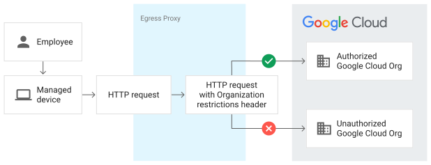

# google_organization_restrictions

This repository will demostrate Google Cloud organization restriction capability which prevents accessing Google Cloud resources outside of an organizations organization boundary. The audience for this repository is the Egress proxy team who will be responsible for adding the authorized header to egress proxy configuration.

No resources will be created, but access to the following will be required.

- List Organization ID
- Project with Logging enabled

## Architecture


## Documentation
- [Overview of Organization Restrictions](https://cloud.google.com/resource-manager/docs/organization-restrictions/overview)
- [Configure Organization Restrictions](https://cloud.google.com/resource-manager/docs/organization-restrictions/configure-organization-restrictions)

## Usage
1. Clone repo
```
git clone https://github.com/jasonbisson/google_organization_restrictions.git

```

2. Login with identity with targeted organization
```
gcloud auth list --filter=status:ACTIVE --format="value(account)" |awk -F@ '{print $2}'
```

3. Execute script to create a  

```
create_organization_header.sh --project_id <Google Cloud Project ID >
```


### Permissions

The account used will require the following roles:

- Organization Viewer (role with only this permission resourcemanager.organizations.get)
- Logs Viewer (Only for project id passed in argument )


### APIs

A project with the following APIs enabled must be used to host the
resources of this module:

logging.googleapis.com

## Contributing

Refer to the [contribution guidelines](./CONTRIBUTING.md) for
information on contributing to this module.

## Security Disclosures

Please see our [security disclosure process](./SECURITY.md).
